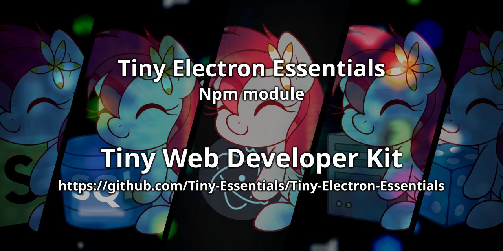

<div align="center">

<p>
    <a href="https://discord.gg/TgHdvJd"></a>
    <a href="https://www.npmjs.com/package/tiny-electron-essentials"></a>
    <a href="https://www.npmjs.com/package/tiny-electron-essentials"></a>
</p>
<p>
    <a href="https://www.patreon.com/JasminDreasond"></a>
    <a href="https://ko-fi.com/jasmindreasond"></a>
    <a href="https://chain.so/address/BTC/bc1qnk7upe44xrsll2tjhy5msg32zpnqxvyysyje2g"></a>
    <a href="https://chain.so/address/LTC/ltc1qchk520v4u8334n5dntmgeja55gc5g5rrkgpd4f"></a>
</p>
<p>
    <a href="https://nodei.co/npm/tiny-electron-essentials/"></a>
</p>
</div>

# 🚀 Tiny-Electron-Essentials

A modular toolkit for simplifying Electron app development.
Provides a set of reusable helpers to manage windows, tray, IPC, notifications, and more with clean and consistent APIs.

---

## 🧠 What is this?

**`tiny-electron-essentials`** is a minimalistic utility library designed to speed up the development of Electron applications.

It offers reliable helpers for:

* 🪟 Window creation and management
* 🖥️ Tray icon control
* 🔗 IPC event handling
* 🔔 Native notifications
* 🏗️ CSS-based custom window frames
* 🔥 App lifecycle control with single-instance locks
* 🌐 Proxy management, file loaders, and more

Everything is built with clarity and extensibility in mind.

---

## 📦 NPM Module

```bash
npm install tiny-electron-essentials
```

---

## 📂 Project Structure

| Folder       | Description                                              |
| ------------ | -------------------------------------------------------- |
| **`src/`**   | 🧠 Main source code for the entire module                |
| **`tests/`** | 🧪 Automated tests for core functionality                |
| **`docs/`**  | 📚 Full documentation with API descriptions and examples |

---

## 📚 Documentation

Full documentation is available in the [`docs/`](./docs) folder.

> ✔️ Includes detailed explanations for all modules:
> Global utilities, Main process controllers, Preload IPC bridges, and more.

---

## 🔗 Useful Links

* 🧠 [View Documentation](./docs)
* 📦 [tiny-electron-essentials on npm](https://www.npmjs.com/package/tiny-electron-essentials)

---

## 🛠️ Requirements

* Electron v23 or higher
* Node.js v18 or higher

---

## 📝 License

This project is licensed under the LGPL-3.0 License - see the [LICENSE](LICENSE) file for details.

> 🧠 **Note**: This documentation was written by [ChatGPT](https://openai.com/chatgpt), an AI assistant developed by OpenAI, based on the project structure and descriptions provided by the repository author.  
> If you find any inaccuracies or need improvements, feel free to contribute or open an issue!

---

## 🔙 Back to Tiny Essentials

Did you like this module? It’s part of the **Tiny Essentials** collection — a set of minimal yet powerful tools to make development easier.
👉 [Click here to explore more Tiny Essentials modules](https://github.com/Tiny-Essentials/Tiny-Essentials)

---

<div align="center">
<a href="./md-assets/img/"></a>
<br/>
Made with tiny love!
</div>